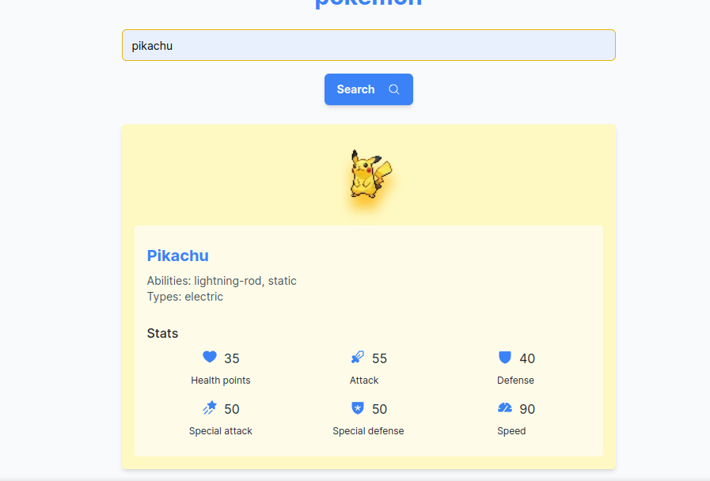

# Your Pokémon

Este é um projeto voltado para a obtenção e tratamento de dados da API [PokéAPI](https://pokeapi.co/). Através de requisições à API, os dados brutos são adquiridos e processados, para então serem consumidos pelo frontend da aplicação.


## Stack utilizada

**Front-end:** React, Next.js, TailwindCSS, TypeScript

**Back-end:** Node, Fastify, TypeScript


## Funcionalidades

- Faz busca de dados sobre pokémons e retorna os seguintes dados:
    - nome;
    - url da imagem do Pokémon;
    - habilidades;
    - tipos;
    - estatísticas de poder:
        - pontos de vida;
        - ataque;
        - defesa
        - ataque especial;
        - defesa especial;
        - velocidade.

## Aprendizados

O que você aprendeu construindo esse projeto? Quais desafios você enfrentou e como você superou-os?

Muito legal ter desenvolvido esse projeto. Consegui aprender ainda mais sobre Next.js e consolidar alguns conhecimentos no Fastify.

Outro ponto importante foi ponderar de maneira assertiva a relação escopo vs tempo. No início tive muitas ideias, com o tempo curto tive que decidir rapidamente as tecnologias e a estrutura dos projetos do backend e do frontend.

No frontend não tem nada de muito novo. O Next.js nos obriga a seguir alguns padrões, portanto tentei deixar a estrutura de pastas com um fácil entendimento. Utilizei [shadcn/ui](https://ui.shadcn.com/) para acelerar o desenvolvimento. É uma ferramenta muito poderosa e que cada vez mais venho utilizando em meus projetos. Também utilizei o conceito de contexts do React para deixar a aplicação mais organizada e componentizada de maneira eficiente. A página inicial é dinâmica e me preocupei com feedbacks visuais para o usuário, como um spinner nos momentos de loading e um toast para aviso de erros.

No backend, por utilizar o Fastify, tive mais liberdade para escolher a maneira mais adequada de estruturar o projeto. Deixei a estrutura mais simples do que normalmente faço em testes desse tipo (separando por domínio e com camadas bem definidas), mas não deixei de lado as boas práticas. Implementei o código buscando respeitar os princípios do SOLID e aplicar alguns conceitos de Clean Architecture para deixar o código bem feito. Decidi não fugir muito do que foi pedido e busquei implementar a aplicação com as boas práticas, como:
- tratamento de erros;
- inversão de dependências;
- validações;
- classes com responsabilidades bem definidas.

Para fechar, utilizei o Docker para que o ambiente esteja de pé rapidamente e sem estresse para quem for testar. Utilizei o Docker Compose para rodar os 2 projetos ao mesmo tempo com apenas um comando. Com isso, pude aprender mais sobre os contexts do Docker após ter tido alguns problemas e ficar sem entender porque os meus containers estavam com arquivos de outros projetos meus.

O sentimento que fica é de dever cumprido e espero que o projeto atinja as expectativas.

## Rodando localmente

Para rodar o projeto certifique-se que tenha o [Docker](https://www.docker.com/) instalado na sua máquina. Também é preciso ter instalado o [Docker Compose](https://docs.docker.com/compose/), que nas novas versões do Docker é instalado junto com o pacote principal. Além disso, é preciso ter o [Node](https://nodejs.org/en/download/) em sua versão 20.

Clone o projeto

```bash
  git clone https://github.com/wcardosos/your-pokemon
```

Entre no diretório do projeto

```bash
  cd your-pokemon
```

Vamos instalar os pacotes localmente:
```bash
cd api/ && npm install
cd ../web && npm install
```

Para iniciar a aplicação basta voltar à raiz do projeto e rodar o comando abaixo:

```bash
cd ../
docker compose up
```

Esse comando irá buildar as imagens, subir os containers e disponibilizar os projetos na sua máquina local.

Para acessar a aplicação, vá nos seguites endereços:
- frontend: http://localhost:3000;
- backend: http://localhost:3333.


## Rodando os testes
Foram feitos os testes unitários da API. Para rodar esses testes, vá até a pasta `api/` rode o seguinte comando:

```bash
  npm run test
```
## Screenshots



